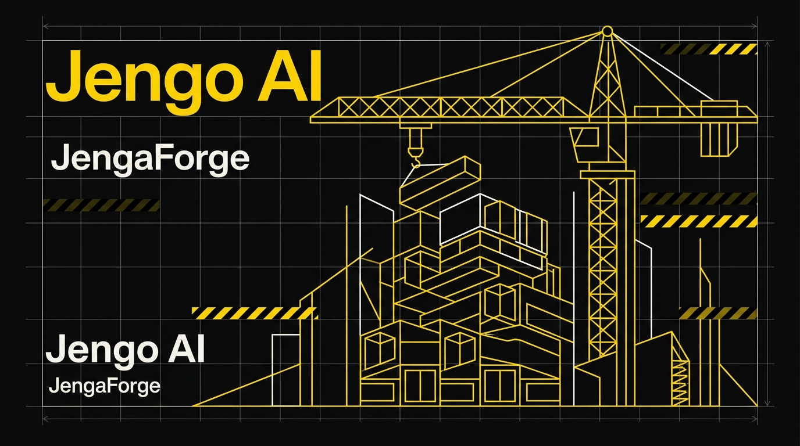

# JengaForge 🏗️

> **Curated AI tools and models registry with Gemini-powered recommendations, workflow stack builder, and side-by-side radar comparisons.**

[](https://jenga-forge.vercel.app)
[](./LICENSE)
[](./.github/workflows/ci.yml)
[](./constants.ts)



---

## 🌟 What is JengaForge?

**Jenga** (*Swahili: to build, to construct*) + **Forge** (*to shape, to engineer*).

JengaForge is an open-source, living repository and workflow architect for creators, developers, and engineers navigating the fast-moving AI ecosystem. Rather than just listing tools, JengaForge helps teams evaluate capabilities, build interoperable "Stacks," and identify deprecated or superseded models before committing engineering resources.

- **Live Production App:** [jenga-forge.vercel.app](https://jenga-forge.vercel.app)
- **GitHub Topics:** `ai-tools` · `generative-ai` · `llm` · `gemini` · `react` · `vite` · `firebase` · `tailwindcss` · `africa` · `kenya`

---

## ✨ Key Features

- **Living AI Tools & Models Registry:** Curated directory across 8 key verticals (Frontier LLMs, AI Coding IDEs, Image Generation, Video Generation, Audio/Speech, Productivity, Autonomous Agents, and Prompt Engineering). Each entry includes pricing tiers, capability radars, and last-verified timestamps.
- **Workflow Stacks Architect:** Combine multiple complementary tools into end-to-end pipelines (e.g. *Autonomous Developer*, *Cinematic Video Creator*, *Deep Research & Synth*). Save, upvote, and share workflow blueprints with one-click public links.
- **Interactive Multi-Model Radar Comparisons:** Side-by-side parametric radar benchmarks tracking Ease of Use, Raw Power, Community Adoption, Cost Efficiency, and Ecosystem Integration.
- **BYOK Gemini Architecture Assistant:** Integrated conversational advisor powered by Google's Gemini SDK (`@google/genai`). Users can leverage system intelligence or bring their own key (stored strictly in browser `localStorage`).
- **Global Search & Command Palette (`⌘K` / `/`):** Fast multi-dimensional search indexing tools, stacks, categories, and tags with full keyboard arrow navigation.
- **Active Deprecation Tracking:** Proactive labeling of discontinued, acquired, or legacy models (e.g., Sora Interactive, Runway Gen-2, DALL·E standalone) with recommended modern migration paths.
- **Brutalist Infrastructure Aesthetic:** High-contrast Kenyan-inspired design system (`#0A0A0A` Jengo Black, `#FFD100` Bunifu Yellow, `#FAF9F5` Paper White) featuring line-based construction motifs and kinetic GPU-composited canvas drafting grids.

---

## 🛠️ Tech Stack

| Layer | Technologies |
|---|---|
| **Frontend Framework** | React 18, TypeScript, Vite |
| **Styling & Design System** | Tailwind CSS v4, Jengo AI Design Language v1.0 |
| **Animation & Visuals** | Framer Motion (`motion/react`), Three.js (`@react-three/fiber`), HTML5 Canvas |
| **Data Visualization** | Recharts (Radar benchmarks, capability matrices) |
| **Backend & Storage** | Firebase Authentication, Cloud Firestore, Express / Node.js proxy |
| **AI Integration** | Google Gen AI TypeScript SDK (`@google/genai`) |
| **Icons & Typography** | Lucide React, Space Grotesk, Inter, JetBrains Mono |

---

## 🚀 Quick Start

### Prerequisites
- Node.js 18.x or 20.x
- npm 9+

### 1. Clone & Install
```bash
git clone https://github.com/Jengo-AI/JengaForge.git
cd JengaForge
npm install
```

### 2. Configure Environment (Optional)
Copy the example environment file:
```bash
cp .env.example .env
```

To enable server-side Gemini Assistant proxying, set your API key in `.env`:
```env
GEMINI_API_KEY=your_gemini_api_key_here
```
*(Alternatively, users can enter their personal key anytime directly in the in-app Profile settings under BYOK mode).*

### 3. Firebase Configuration
Firebase web configuration is provided in `firebase-applet-config.json` for seamless client-side authentication and Firestore persistence. Security is enforced directly via `firestore.rules`.

If you prefer to connect your own Firebase project:
1. Create a Firebase project at [console.firebase.google.com](https://console.firebase.google.com).
2. Enable **Authentication** (Email/Password & Google Provider) and **Cloud Firestore**.
3. Update `firebase-applet-config.json` with your project's web credentials.
4. Deploy the security rules:
   ```bash
   firebase deploy --only firestore:rules
   ```

### 4. Run Development Server
```bash
npm run dev
```
Open [http://localhost:3000](http://localhost:3000) in your browser.

### 5. Build for Production
```bash
npm run build
```

---

## 📋 The Living AI Registry (Status: October 2026)

JengaForge tracks the frontier shift toward reasoning models, deep research agents, and autonomous multimodal pipelines:

| Model / Tool | Category | Status | Primary Focus |
|---|---|---|---|
| **Claude Sonnet 5.5** | LLM / Dev | `Active` | Coding precision benchmark, next-gen Computer Use, 40% cost reduction |
| **Claude Opus 5.5** | LLM | `Active` | Autonomous architecture, zero-shot complex logic, senior reasoning |
| **GPT-6 Astra** | LLM | `Active` | Multi-agent orchestration, infinite collaborative canvas, deep verification |
| **Gemini 4 Argon** | LLM | `Active` | Enterprise frontier model with 1M context for software engineering & cyber |
| **Gemini 3.1 Pro** | LLM | `Active` | Deep System 3 reasoning, 5M+ context window, cross-modal orchestration |
| **Grok 4.7** | LLM | `Active` | Coding endurance self-verification and real-time global telemetry |
| **DeepSeek-V4.1-Flash** | LLM | `Active` | Sovereign open-weight visual understanding, high math/logic efficiency |
| **Cursor Agent (v4)** | Dev Tools | `Active` | Multi-file codebase synthesis and autonomous repository generation |
| **v0.dev (V3)** | Dev Tools | `Active` | Instant full-stack UI and component generation |
| **Runway Gen-4.5** | Video Gen | `Active` | Directing control, camera stabilization, physics rendering |
| **Google Veo 3.1** | Video Gen | `Active` | 1080p cinematic generation with synchronized audio |
| **FLUX 3 Image** | Image Gen | `Active` | 4K multimodal foundation, bounding-box composition, pixel layout control |
| **Midjourney V8.2** | Image Gen | `Active` | Instruction-based edits, 2K/4K HD native outputs, aesthetic personalization |
| **Sora Interactive** | Video Gen | `Deprecated` | Discontinued March 24, 2026. Superseded by Runway Gen-4.5 and Veo 3.1 |
| **DALL·E Standalone** | Image Gen | `Deprecated` | Subsumed natively inside ChatGPT canvas |
| **Runway Gen-2** | Video Gen | `Deprecated` | Superseded by Runway Gen-4.5 World Engine |

---

## 🤝 Contributing

We welcome community contributions, tool submissions, and dataset updates!

- **Suggest a New AI Tool / Model:** Open an issue using the [Tool Suggestion Template](.github/ISSUE_TEMPLATE/suggest_tool.yml).
- **Report Outdated Info or Deprecation:** Open an issue using the [Report Outdated Info Template](.github/ISSUE_TEMPLATE/report_outdated.yml).
- **Code Contributions:** Please ensure your changes pass `npm run lint` and `npm run build` before opening a Pull Request.

---

## 📄 License

This project is licensed under the [MIT License](./LICENSE) — free for community and commercial use.

Built with pride by the **Jengo AI** engineering collective · Nairobi, Kenya 🇰🇪
